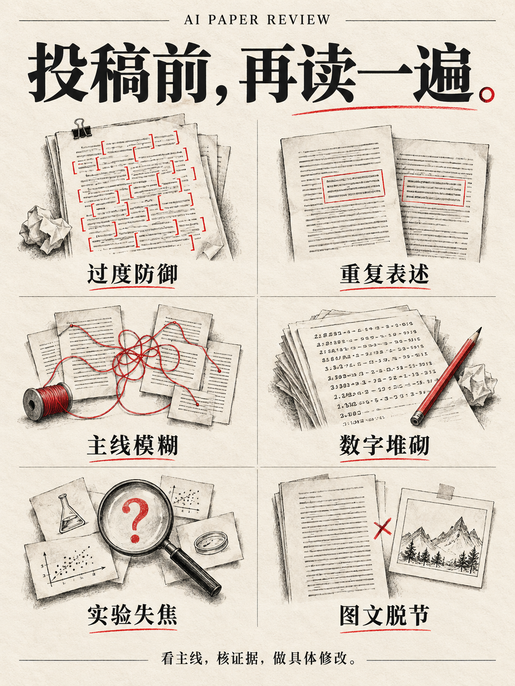

<a id="top"></a>

<div align="center">


<h1>AI Paper Review</h1>
<p><strong>Turn recurring reviewer concerns into concrete manuscript revisions.</strong></p>
<p>Research motivation · Argument structure · Results interpretation · Specific edits</p>

[](LICENSE)
[](scripts/README.md)
[](scripts/README.md)

[中文](README.md) · [English](README.en.md)

</div>

A skill for authors and review assistants: it turns the problems reviewers raise most often into checkable items, locates them in the manuscript, and lands them as concrete revisions. Ships with a local text scanner that uses only the Python standard library.

## Table of contents

- [Quickstart](#quickstart)
- [A worked edit](#example)
- [Why this exists](#why)
- [Six recurring problems](#problems)
- [Workflow and priorities](#workflow)
- [Local text scanner](#scanner)
- [Image gallery](#gallery)
- [Documentation map](#resources)
- [Contributing](#contributing)
- [License](#license)

<a id="quickstart"></a>

## Quickstart

**Install:** place the repository in your client's skill directory as `ai-paper-review`, if it supports `SKILL.md`. Alternatively, ask your agent to read the root `SKILL.md`, then provide the manuscript. Installation entry points vary by client.

**Review a full paper:**

```text
Use ai-paper-review to review this manuscript.
Check the research question and claim–evidence links first,
then repetition, results interpretation and figures.
Give at most three priority issues, each with a source location,
its impact and a concrete next edit.
```

**Revise a passage directly:**

```text
Use ai-paper-review to revise this Results passage and return the edited text.
Preserve the real values, necessary qualifications and negative findings.
Do not add experiments or conclusions.
```

The reference material is primarily in Chinese; the workflow applies to English or Chinese manuscripts.

<a id="example"></a>

## A worked edit

<table>
<tr>
<th align="left" width="50%">Before · Listing the numbers</th>
<th align="left" width="50%">After · Explaining the tradeoff</th>
</tr>
<tr>
<td valign="top">
<p>Baseline throughput was 100.000000 tasks/min. Our method achieved 112.000000 tasks/min. The runtime was 8.700000 ms. The baseline runtime was 8.200000 ms.</p>
</td>
<td valign="top">
<p>In this setting, throughput increased from <strong>100 to 112 tasks/min (+12%)</strong>, while planning time rose from <strong>8.2 to 8.7 ms (+0.5 ms)</strong>.</p>
</td>
</tr>
</table>

<sub>Synthetic example using identical underlying numbers. No independent repetitions were supplied, so no significance claim is added.</sub>

The revision states the comparison, benefit, cost and scope. [Explore all six worked examples →](examples/before_after.md)

<a id="why"></a>

## Why this exists

After discussing these papers with multiple reviewers and reading a large number of AI-written and AI-assisted papers in **2026**, I kept encountering the same problem: fluent prose, cautious claims and detailed statistical reporting could still leave the research difficult to understand.

The weaknesses reach into **motivation, argument structure and interpretation**. Replacing words or lowering a detector score cannot repair a missing argument.

**This skill turns recurring concerns from that inquiry into checks tied to manuscript locations and concrete revisions.**

<a id="problems"></a>

## Six recurring problems

<table>
<tr>
<td width="50%" valign="top">
<h3>01 · Defensive prose</h3>
<p><strong>Caveats fill the page; the central claim disappears.</strong></p>
<p>Repeated qualifications leave readers unsure what the authors actually claim or where its scope ends.</p>
</td>
<td width="50%" valign="top">
<h3>02 · Repetition across sections</h3>
<p><strong>The introduction and method repeat the same sentence.</strong></p>
<p>New sections add no definitions, implementation details or evidence. The argument does not progress.</p>
</td>
</tr>
<tr>
<td width="50%" valign="top">
<h3>03 · Missing research storyline</h3>
<p><strong>Many experiments. Why study this problem?</strong></p>
<p>Motivation, design and experiments do not connect. Central evidence and supplementary analyses have no clear hierarchy.</p>
</td>
<td width="50%" valign="top">
<h3>04 · Confusing results</h3>
<p><strong>Six decimal places; an unclear finding.</strong></p>
<p>Inconsistent precision and pasted statistical summaries obscure the key comparison, benefit, cost and scope.</p>
</td>
</tr>
<tr>
<td width="50%" valign="top">
<h3>05 · An experiment log</h3>
<p><strong>Experiment after experiment ends without a conclusion.</strong></p>
<p>The paper does not explain what was ruled out, what was learned or how uncertainty affects its central claims.</p>
</td>
<td width="50%" valign="top">
<h3>06 · Space without information</h3>
<p><strong>The page count grows; essential explanations are missing.</strong></p>
<p>Long related-work sections, oversized figures and limitations occupy space needed for the research design and interpretation.</p>
</td>
</tr>
</table>

> **A concern about writing that caters to AI evaluation.**
>
> If cautious wording and statistical detail are treated as sufficient evidence of rigor, a paper with an unclear problem and weak argument may receive an inflated evaluation. The inquiry made this concern central to the workflow: assess the problem, the claim and its supporting evidence.

<a id="workflow"></a>

## Workflow and priorities

<table>
<tr>
<td width="33%" valign="top">
<h3>01 / Read the argument</h3>
<p>Why study this problem?<br>Which difficulty does the method address?<br>What does the main experiment test?</p>
<p><a href="references/storyline.md">Storyline checks →</a></p>
</td>
<td width="34%" valign="top">
<h3>02 / Check the evidence</h3>
<p>Which evidence supports each claim?<br>What are the benefits and costs?<br>How do counterexamples change the conclusion?</p>
<p><a href="templates/claim_evidence.md">Claim–evidence table →</a></p>
</td>
<td width="33%" valign="top">
<h3>03 / Revise the text</h3>
<p>Locate the relevant passage.<br>Distinguish missing evidence from unclear prose.<br>Specify the next edit.</p>
<p><a href="templates/author_revision.md">Revision template →</a></p>
</td>
</tr>
</table>

Each finding includes a **source location, evidence, practical impact and a specific revision**.

| Priority | What to address |
| :--- | :--- |
| **P0 · Core evidence** | A central claim lacks support or conflicts with the results |
| **P1 · Essential explanation** | A gap in motivation, method or interpretation breaks the argument |
| **P2 · Local presentation** | Repetition, numerical precision or figure organization obstructs reading |

[Read a complete synthetic review →](examples/demo_review.md)

<a id="scanner"></a>

## Local text scanner

Python 3.9+, standard library only, no network calls.

```bash
git clone https://github.com/malevrigns/aipaper-skill.git
cd aipaper-skill
python scripts/ai_paper_check.py examples/demo_paper.md
python scripts/ai_paper_check.py paper.md --json report.json --markdown report.md
python scripts/ai_paper_check.py --sections intro.txt method.txt results.txt
```

Accepts UTF-8 text, Markdown and simple LaTeX. Extract PDF text separately; review figures and layout separately.

The supplied demo reproduces four candidate types: defensive phrase clusters, repetition across sections, an unreplaced parameter and inconsistent precision within a table column. The scanner locates text candidates; semantic review requires reading the manuscript.

Successful scans exit `0`; `--fail-on-findings` opts into exit `1` when candidates exist. Input errors return `2`. [Parameters, exit codes and parser scope →](scripts/README.md)

<a id="gallery"></a>

## Image gallery

One landscape banner and four portrait posters, with paper collage, manuscript annotations and vermilion accents. Click a thumbnail to open the original. The artwork and its typography are in Chinese.

<p align="center">
<a href="media/images/campaign-poster.png"></a>
<a href="media/images/six-review-issues.png"></a>
<a href="media/images/experiments-to-findings.png"></a>
<a href="media/images/author-revision.png"></a>
</p>
<p align="center"><sub><a href="media/images/campaign-poster.png">02 · Caution</a> · <a href="media/images/six-review-issues.png">03 · Six problems</a> · <a href="media/images/experiments-to-findings.png">04 · Findings</a> · <a href="media/images/author-revision.png">05 · Revision</a></sub></p>

[01 / Original README banner](assets/hero-editorial.png) · [Image directory and usage notes](media/README.md)

<a id="resources"></a>

## Documentation map

| Task | Start here |
| :--- | :--- |
| Review or revise a manuscript with an agent | [Skill entry point](SKILL.md) · [Checklist](checklists/ai_flavor.md) |
| Connect motivation, claims and evidence | [Storyline](references/storyline.md) · [Evidence table](templates/claim_evidence.md) |
| Improve results and figures | [Results reporting](references/results_reporting.md) · [Figure checks](checklists/figure_standards.md) |
| Write a review or revision plan | [Review template](templates/review_report.md) · [Revision template](templates/author_revision.md) |
| Explore examples and run a scan | [Worked edits](examples/before_after.md) · [Synthetic review](examples/demo_review.md) · [Scanner](scripts/README.md) |
| Contribute a problem or counterexample | [Contribution guide](CONTRIBUTING.md) · [Reviewer calibration](references/reviewer_calibration.md) |

<details>
<summary><strong>Reporting conventions, review scope and version compatibility</strong></summary>

CI and p values may belong in the main text. Negative results can make a valuable contribution. A framework figure is useful when the method needs one; its absence is not automatically a defect. Every finding needs evidence and an explanation of its impact.

Version 2 removes the unvalidated AI-flavor score and authorship labels. JSON consumers must migrate to `schema_version: "2.0"`, `findings` and `coverage`. This repository does not provide validated authorship detection or acceptance predictions. [Rubric and migration notes →](rubric.md)

The promotional illustrations communicate review topics; they do not depict real manuscripts or measured research results.

</details>

<a id="contributing"></a>

## Contributing

Problem cases and counterexamples are welcome — please read the [contribution guide](CONTRIBUTING.md) first.

<a id="license"></a>

## License

[MIT License](LICENSE)

---

<div align="center">
<p><strong>Why study this problem? What was learned? Where is the evidence?</strong></p>
<p>These questions are the starting point for this skill.</p>
<p><a href="#top">Back to top ↑</a></p>
</div>
